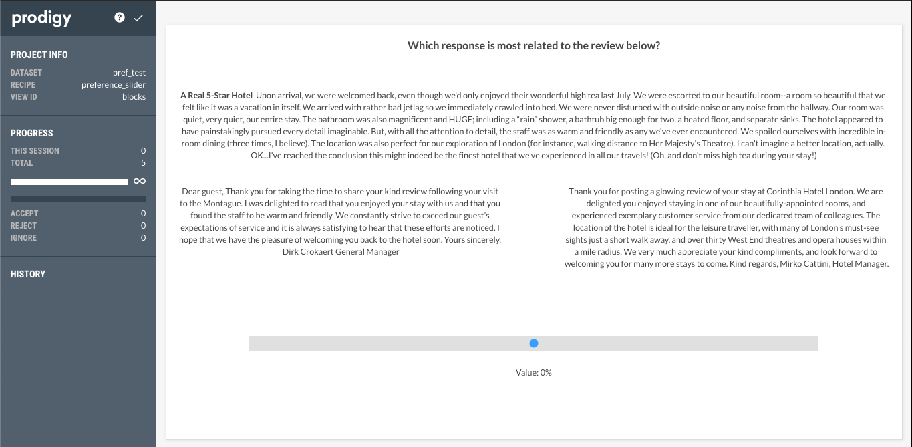

Basic evaluation schema for collecting user preference ratings for certain criteria.
Idea is to perform pairwise comparisons between models and then ranking with TrueSkill.

## Tips and tricks

Useful config settings: https://prodi.gy/docs/install#config

Relevant Support Topics:
- https://support.prodi.gy/t/saving-user-ratings-to-a-task-from-html-inputs/4468

## To Luanch

```
prodigy preference_slider pref_test data/hospo_respo_data/hospo_respo_sample.jsonl -F recipe.py
```

```
prodigy preference_slider pref_test_mbart_simpl data/ats_data/de_A1.human_eval.jsonl -F recipe.py
```

## Evaluation Schema Preview



## Known issues

- ticks on HTML range input do not appear